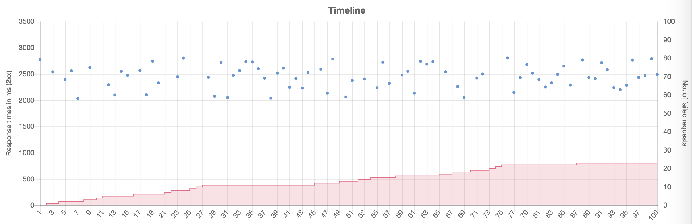

# Nuker
Super simple HTTP load test library and CLI. Sends *n* requests spread evenly over *m* seconds and charts the response times. Supports form-data.

## Install

```bash
$ npm i nuker -g
```

## Usage

```bash
$ nuker --host www.example.com --count 100 --time 10
```



## Arguments

* `--hostname` `-H` *[required]* - Endpoint (e.g.:  `-p http://foo.bar:8080`)
* `--count` `-C` - Number of requests to send
* `--time` `-T` Duration of the test in seconds
* `--method` `-m`  - Request method (e.g.: `-m POST`)
* `-path` `-p` - URI path component (e.g.: ` -p foo/bar`)
* `--guery` `-q` *[multiple]* - URI query component (e.g.: `-q foo=bar -q baz=qux`)
* `--header` `-h` *[multiple]* - Request header(s) (e.g.: `-h Accept-Charset=utf-8, -h Accept-Language=en-US`)
* `--formField` `-f` *[multiple]* - Form field(s) (`-f foo=bar -f baz=qux`)
* `--formFile` `-F`  *[multiple]* - Path of the file(s) to append to *form-data* requests (e.g.: `-F foo="./bar.jpg"`, where "foo" is the key for the field)
* `--body` `-b` - Raw text content for body (e.g.: `-b "foobar"`)
* `--bodyPath` `-B` - Path to raw binary content for body (e.g.: `-B "./bar.jpg"`)
* `--outPutpath` `-o` - Path for the output file (e.g.: `-o ./results.html`).
* `--timeout` `-t` - Request timeout in milliseconds. Default is 120 seconds. If TCP connection cannot be established, this will be overwritten by OS default.

## Config file

```bash
$ nuker --config ./examples/config.json
```

Same options as command line arguments in JSON. See in 'examples'.
You can add multiple tests to the the config file, they will be executed sequentially.

## Test server

```bash
$ npm run server
```

Basic test server with configurable response times and codes. Default port is `4343`.

E.g.: `http://localhost:4343?wait=3000&statusCode=400`
